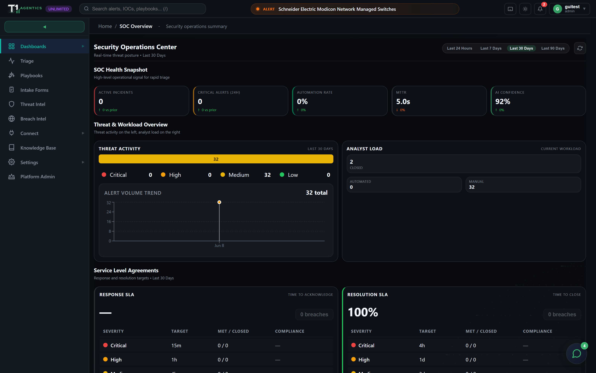
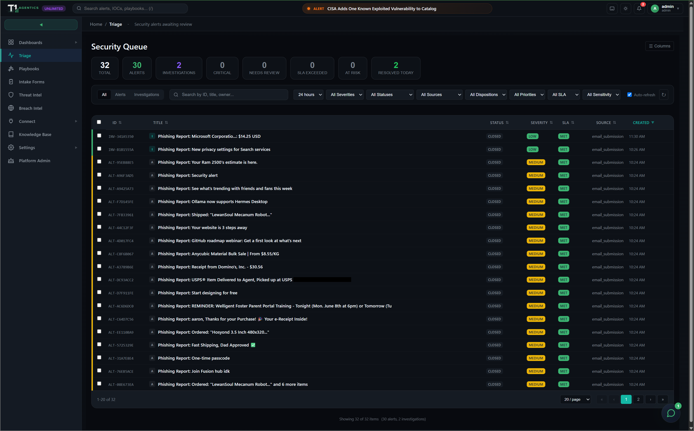
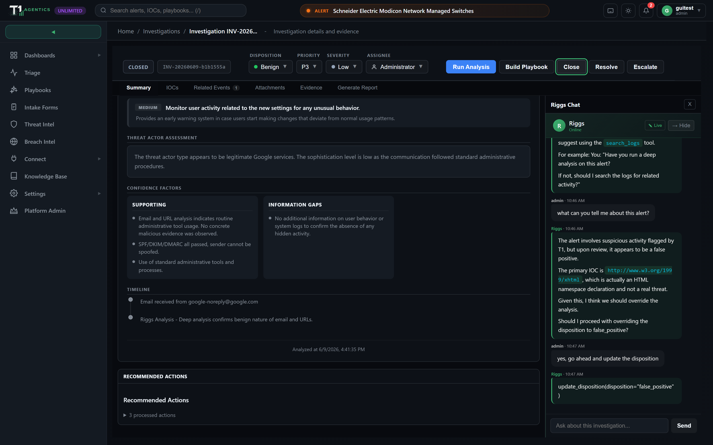
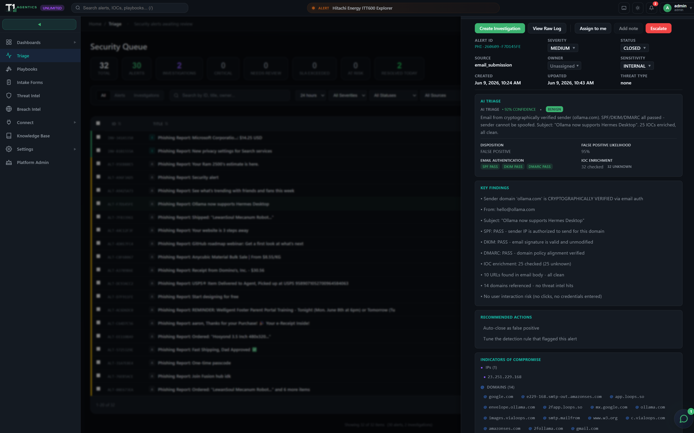
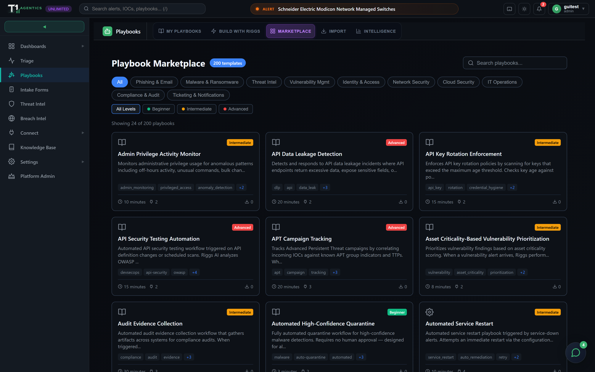
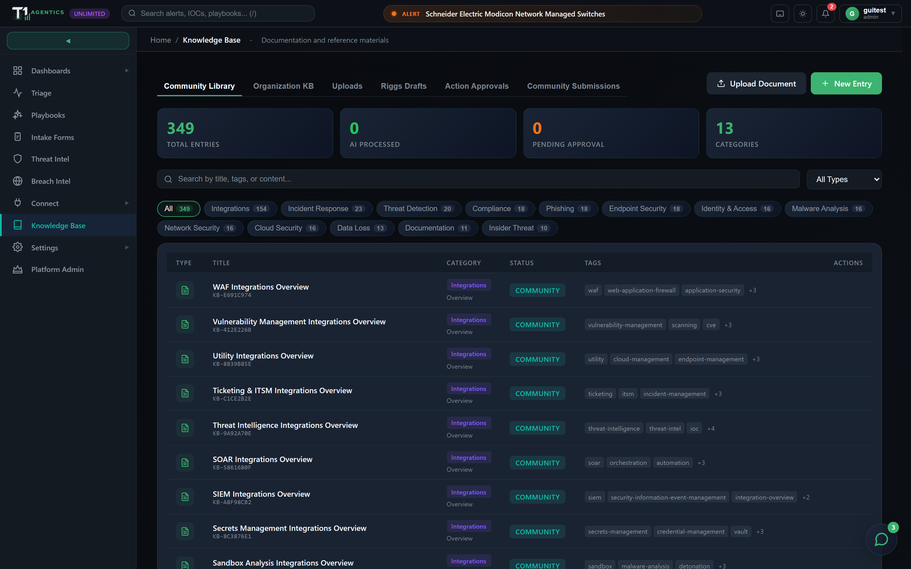

# T1 Agentics

> Open-source, self-hosted, multi-tenant SOC platform with AI-assisted triage.

[](LICENSE)
[](#)
[](https://github.com/BeardedInfoSec/t1agentics)

<p align="center">
  
</p>

T1 Agentics is a self-hosted, multi-tenant SOC platform: it ingests alerts from your existing tools, triages them with an AI assistant of your choice, walks investigations through a structured workbench, and runs remediation through 700+ pre-built connectors. Tenants are isolated at the database layer with Row-Level Security, which makes it useful for MSPs, consultancies, and in-house teams running more than one environment.

**Docs:** [INSTALL.md](INSTALL.md) · [CONFIGURATION.md](CONFIGURATION.md) · [TROUBLESHOOTING.md](TROUBLESHOOTING.md) · [OVERVIEW.md](OVERVIEW.md) · [SECURITY.md](SECURITY.md) · [CONTRIBUTING.md](CONTRIBUTING.md)

---

## Quick start

With Docker installed:

```bash
git clone https://github.com/BeardedInfoSec/t1agentics
cd t1agentics
./install.sh
```

`install.sh` runs preflight checks, prompts for your domain and an optional AI provider, generates secrets, writes `.env` and `t1.config.yaml`, builds the images, starts the stack, bootstraps the first platform admin, and seeds the built-in content libraries (playbook marketplace + knowledge base). The web UI comes up on port 443 once DNS resolves. See [INSTALL.md](INSTALL.md) for the manual and native paths.

---

## Screenshots

<p align="center"></p>

<table>
  <tr>
    <td width="50%"><br><sub><b>AI deep-dive analysis</b> — Riggs runs a deep analysis (threat assessment, MITRE ATT&CK mapping, root cause) and proposes concrete actions you approve or dismiss.</sub></td>
    <td width="50%"><br><sub><b>Triage at a glance</b> — an alert's verdict, key findings, and IOCs surface in the queue drawer before you open the case.</sub></td>
  </tr>
  <tr>
    <td width="50%"><br><sub><b>Playbook marketplace</b> — 200+ ready-to-run response playbooks across phishing, malware, identity, cloud, and more.</sub></td>
    <td width="50%"><br><sub><b>Knowledge base</b> — 340+ built-in SOC runbooks and reference articles, searchable in-product.</sub></td>
  </tr>
</table>

---

## Requirements

- **8 GB RAM** minimum (16 GB recommended for multi-tenant workloads)
- **~20 GB disk** minimum (event history, raw alert payloads, and the KB index grow over time)
- **Docker 20.10+** and **Docker Compose v2**
- Docker host on **Linux** (recommended for production; Ubuntu 22.04 LTS+ is the tested baseline), macOS (Docker Desktop), or Windows (Docker Desktop + WSL2; run the install inside the WSL2 shell)
- A domain name with DNS pointing to your host (required for automatic TLS)
- Optional: an AI provider — a cloud key (Anthropic / OpenAI) or a local OpenAI-compatible server (Ollama / vLLM / LM Studio). An **NVIDIA GPU** is optional but speeds up local models. AI features are off until one is configured.

The installer enforces the RAM and disk checks and prints a clear error if your host is under-provisioned.

---

## Run without Docker (experimental)

Don't want to run Docker? There's a single-process native mode that boots an embedded PostgreSQL (shipped as a pip wheel — no system Postgres, no admin rights) and serves the whole app (UI + API + WebSocket) on one port. Needs **Python 3.11 or 3.12** and Node (to build the frontend once).

```bash
git clone https://github.com/BeardedInfoSec/t1agentics
cd t1agentics
./run-native.sh            # Linux / macOS
#   .\run-native.ps1       # Windows PowerShell
```

It creates a virtualenv, installs dependencies, builds the frontend, starts a local Postgres under `./.native/`, and opens `http://localhost:8000`. Redis and ClickHouse are off in this mode (the app falls back gracefully). This is the easiest way to try it on a laptop — no Docker Desktop, no WSL2. Docker Compose remains the path for production multi-tenant deployments with automatic TLS.

---

## What you get

- **Multi-tenant from day one.** Row-level security enforced at the database layer. A tenant context is set on every connection acquire; cross-tenant leaks require defeating both the app-layer auth check and the database policy.
- **700+ pre-built connectors** across SIEM, EDR, firewall, cloud, ticketing, email security, deception, and threat intel categories.
- **200 playbook templates** covering 13 SOC domains. Visual editor on a node-graph canvas. Import/export converters for several legacy SOAR formats.
- **349 knowledge-base articles** with full-text search and optional semantic search (pgvector).
- **AI-assisted triage** that reads the alert, correlates entities, scores the verdict, and proposes concrete actions mapped to connectors you actually have installed. Bring your own LLM provider API key.
- **Investigation workbench** with inline classification (disposition, priority, severity, assignee), a unified queue, and customizable per-dashboard columns.
- **Pause-and-collect playbook forms** for analyst input mid-flow, with HMAC-signed public URLs for external participants.
- **RBAC, RLS, audit logs.** Every privileged operation is logged. Every tenant-scoped query is gated.
- **All in Docker Compose.** One file, one stack, no Kubernetes required.

---

## Built-in content

The installer seeds two content libraries so the app is populated on first login:

- **Playbook marketplace** — 200 builtin playbook templates across 13 SOC domains.
- **Knowledge base** — ~349 articles (a few use a content type the schema does not yet allow and are skipped, so roughly 300 load).

Seeding is idempotent — the playbook loader upserts and the KB loader skips articles that already exist by title, so it is safe to rerun. If you ran a manual `docker compose up -d` install instead of `install.sh`, or you want to re-seed, run:

```bash
# Built-in content lives at the repo root; the backend image is built from
# ./backend, so copy the seed scripts and content into the container first.
docker compose cp scripts/load-playbook-catalog.py backend:/app/scripts/load-playbook-catalog.py
docker compose cp scripts/load-kb-direct.py        backend:/app/scripts/load-kb-direct.py
docker compose cp playbook-store-output            backend:/app/playbook-store-output
docker compose cp kb-content-output                backend:/app/kb-content-output

# Seed
docker compose exec -T backend python scripts/load-playbook-catalog.py
docker compose exec -T backend python scripts/load-kb-direct.py kb-content-output/articles
```

**Intake-form templates** (20 of them) are built into the backend and served live from the API — they need no seeding. The `intake_forms` table stays empty until a tenant instantiates a form.

---

## Architecture

```
                       Caddy (TLS, reverse proxy)
                                |
            +-------------------+--------------------+
            |                                        |
        Frontend                                  Backend
        (React, nginx)                       (FastAPI, Python 3.11)
                                                  |
            +-------------+----------+-------------+
            |             |          |             |
        PostgreSQL     Redis     ClickHouse    Connectors
        (primary)    (sessions,  (telemetry,   (outbound to
                      queue)     event volume) your stack)
```

- **Backend** — FastAPI on Python 3.11, asyncpg, asyncio throughout. Migrations apply on startup; no separate migrate step.
- **Frontend** — React 18 single-page app served by nginx. Visual playbook editor built on a node-graph canvas.
- **Databases** — PostgreSQL 15 (primary, with RLS), Redis 7 (sessions, rate limiting, queue), ClickHouse (UX telemetry, high-volume event ingest).
- **TLS** — Caddy fronts the stack and obtains Let's Encrypt certificates automatically when your domain DNS resolves to the host.
- **Everything in Docker Compose.** One stack file, one `up -d`.

For a deeper tour, see [OVERVIEW.md](OVERVIEW.md) and the engineering docs under [docs/](docs/).

---

## Configuration

The app is configured by a single file at the repo root, **`t1.config.yaml`**, read by the backend on every startup and applied idempotently to the database. Secrets stay in `.env` and are referenced with `${ENV_VAR}`; the admin password comes from `ADMIN_PASSWORD`. The installer writes both files for you.

The smallest useful config — name your org and point the AI at a local Ollama:

```yaml
org:
  name: "Acme Security"
  slug: "acme-security"

license:
  tier: "platform"          # unlimited; self-host recommended

ai:
  chat:
    provider: "self_hosted" # self_hosted | anthropic | openai
    api_style: "openai"
    base_url: "http://host.docker.internal:11434"
    model: "qwen2.5:7b-instruct"
    api_key: "${AI_CHAT_API_KEY}"
```

Edit it, then apply: `docker compose up -d backend`. Full reference (every section, plus worked Anthropic / Ollama / vLLM examples) is in **[CONFIGURATION.md](CONFIGURATION.md)**.

---

## Troubleshooting

A few of the most common issues — full guide in **[TROUBLESHOOTING.md](TROUBLESHOOTING.md)**.

- **"No AI provider configured or available."** AI ships off. Set `ai.chat` in `t1.config.yaml` (or **Settings → AI**) and `docker compose up -d backend`.
- **Mixed-content errors / `http://` redirects behind a proxy.** Your proxy must send `X-Forwarded-Proto`; keep `FORWARDED_ALLOW_IPS=*` on the backend (the shipped compose already sets it).
- **Marketplace / Knowledge Base empty.** Content wasn't seeded — `install.sh` seeds it, or run the seed scripts (see [INSTALL.md](INSTALL.md#seeding-built-in-content)).
- **Deep analysis / Recommended Actions missing.** Premium features — set a paid `license.tier` and confirm the AI provider works.
- **Login asks for an "Organization."** Enter your tenant slug (`org.slug`, set at install).

Get logs with `docker compose logs -f backend` (or `./bin/t1 logs backend`).

---

## Upgrading

```bash
t1 upgrade
```

The `t1` helper script pulls the latest images, applies any pending migrations, and restarts the stack with zero data loss. Run `t1 upgrade --dry-run` first if you want to see what would change.

If you prefer to drive Docker Compose directly:

```bash
docker compose pull
docker compose up -d
```

---

## Backup

```bash
t1 backup
```

Writes a timestamped archive containing a Postgres dump, the ClickHouse data directory, the credentials vault, and the configuration files. Restore with `t1 restore <path>`.

For offsite backups, schedule `t1 backup --output /mnt/your-mount/` from cron.

---

## Community and support

- **Bugs:** [GitHub Issues](https://github.com/BeardedInfoSec/t1agentics/issues)
- **Questions, ideas, show-and-tell:** [GitHub Discussions](https://github.com/BeardedInfoSec/t1agentics/discussions)
- **Security disclosures:** see [SECURITY.md](SECURITY.md) — please do not file public issues for vulnerabilities

---

## License

Apache License 2.0. See [LICENSE](LICENSE).

You can use T1 Agentics for any purpose, modify it, and redistribute it. We ask that you keep the attribution and license headers intact.

---

## Contributing

We accept bug fixes, connector additions, playbook templates, knowledge-base articles, documentation improvements, and well-scoped feature work. See [CONTRIBUTING.md](CONTRIBUTING.md) for the workflow.
